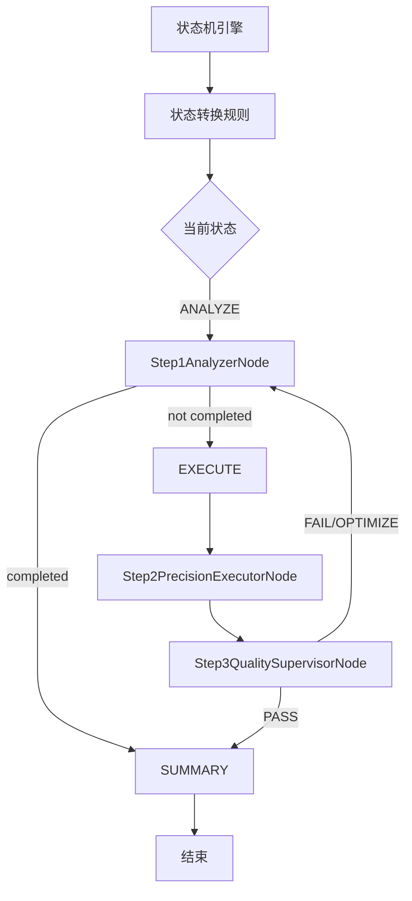

### 总体评价  
该文档是对AI Agent自动执行流程的清晰设计描述，主要优化了流程可视化（从ASCII转为Mermaid）、职责结构化呈现及术语一致性。**当前可作为生产环境的设计文档使用**，但需确保与实际代码逻辑完全一致，风险等级为**低**（需验证逻辑一致性后可投入生产）。


### 问题清单（按严重程度排序）  
1. **严重问题**  
   - **问题描述**：流程图中的决策点逻辑（如Gate节点“已完成或进度=100%”的判断）与实际代码逻辑一致性未验证。  
   - **技术依据**：文档中“Step1AnalyzerNode”的决策条件依赖“分析结果包含COMPLETED或进度=100%”，若实际代码中“progress”字段未准确反映任务进度（如因数据延迟或计算误差导致进度误判），将导致流程分支错误（如过早进入总结节点或循环异常）。  
   - **影响**：可能导致任务执行失败（如未完成但强制结束）、资源浪费（如不必要的循环）或业务逻辑偏差。  

2. **一般问题**  
   - **问题描述**：术语命名一致性需统一（如“COMPLETED”与“完成”“PASS/FAIL/OPTIMIZE”与“通过/失败/优化”混用）。  
   - **技术依据**：文档中“COMPLETED”在流程图和决策点描述中未统一为“完成”，而“PASS/FAIL/OPTIMIZE”在质量监督节点中未统一为“通过/失败/优化”，可能导致团队理解偏差。  
   - **影响**：轻微降低文档可读性，增加跨模块沟通成本。  

3. **可优化项**  
   - **问题描述**：SSE流结构描述未明确分布式场景下的传输可靠性（如网络中断、数据丢失的处理）。  
   - **技术依据**：文档中“SSE stream structure”仅列出各步骤输出字段，未提及客户端如何处理流中断或重连，需补充容错机制说明。  
   - **影响**：在高并发或分布式环境下，若SSE流中断，可能导致客户端数据丢失或任务状态不一致。  


### 改进建议  
1. **验证流程逻辑与代码一致性**  
   - **方案**：通过代码审查或单元测试用例，确认Step1AnalyzerNode的判断条件（分析结果中的“progress”字段）是否与实际业务逻辑匹配。例如，添加测试用例验证“progress=100%”时任务是否确实完成，避免因字段误差导致流程错误。  
   - **示例**：  
     ```java
     // 测试用例示例
     @Test
     void testProgressCheck() {
         DynamicContext context = new DynamicContext();
         context.set("analysis_progress", 99.9); // 非常接近100%
         context.set("analysis_task_status", "COMPLETED"); // 包含完成状态
         // 预期：判断为已完成，进入Step4
         assertTrue(analyzerNode.shouldProceedToStep4(context));
     }
     ```

2. **统一术语命名**  
   - **方案**：将文档中的术语统一为系统标准（如“COMPLETED”→“完成”，“PASS/FAIL/OPTIMIZE”→“通过/失败/优化”），并在代码注释、API文档中同步更新。  
   - **示例**：  
     ```java
     // 代码注释示例
     /**
      * 分析结果包含“完成”状态或进度≥100%时，进入总结节点
      */
     boolean isCompleted(DynamicContext context) {
         return context.get("analysis_task_status").equals("完成") || context.get("analysis_progress") >= 100;
     }
     ```

3. **补充SSE流容错机制说明**  
   - **方案**：在文档中增加“SSE流可靠性设计”章节，明确客户端如何处理流中断（如自动重连、状态回溯），并建议实际系统中使用重试机制（如Spring Cloud Stream的SSE重试配置）。  
   - **示例**：  
     ```mermaid
     flowchart TB
         Client -->|SSE中断| Retry[重试机制]
         Retry -->|成功| SSEStream[重新连接]
         SSEStream -->|数据接收| Client
     ```

4. **增强DynamicContext字段可追溯性**  
   - **方案**：在文档中补充DynamicContext类的字段定义（如`aiAgentClientFlowConfigVOMap`的具体结构），帮助开发人员快速理解数据结构，降低维护成本。  
   - **示例**：  
     ```java
     // DynamicContext类示例
     public class DynamicContext {
         private Map<String, Object> aiAgentClientFlowConfigVOMap; // 客户端配置
         private List<ExecutionRecord> executionHistory; // 执行历史
         private Task currentTask; // 当前子任务
         private int step; // 当前轮次
         private int maxStep; // 最大轮次
         private boolean completed; // 完成标记
         private AnalysisResult analysisResult; // 分析结果
         private ExecutionResult executionResult; // 执行结果
         private SupervisionResult supervisionResult; // 监督结果
         private SummaryResult finalSummary; // 最终总结
     }
     ```


### 更优设计思路（针对架构缺陷）  
若未来需扩展至高并发、分布式场景，建议采用**状态机设计模式**重构流程控制：  
1. **状态机定义**：将流程拆分为状态（如`START`、`ANALYZE`、`EXECUTE`、`SUPERVISE`、`SUMMARY`），每个状态对应一个处理逻辑。  
2. **状态转换规则**：通过状态机引擎（如Spring State Machine）管理状态转换，确保逻辑清晰且可扩展。  
3. **分布式状态管理**：使用分布式锁（如Redis分布式锁）或数据库事务管理状态一致性，避免多实例并发导致的冲突。  
4. **容错机制**：在状态机中集成重试机制（如分析失败后自动重试），并记录状态转换日志（如SSE流），便于故障排查。  

**示例架构图**：  



### 总结  
该文档已满足设计文档的基本要求，但需重点验证流程逻辑与代码的一致性，并补充术语统一和SSE流容错机制。通过上述改进，可确保文档与实际系统完全对齐，支持生产环境部署。